<!-- _class : invert -->
# Combining prompt-based language models and weak supervision for labeling named entity recognition on legal documents

Vitor Oliveira :large_blue_diamond: Gabriel Nogueira :large_blue_diamond: Thiago Faleiros :large_blue_diamond: Ricardo Marcacini

---
<!-- paginate: true -->

# :ledger: Agenda

- Dataset
- Problem addressed
- Solution
  - Prompt-based language models
  - Weak supervision
- Experiments
- Results
- Conclusion

---
<!-- _class : invert -->
# :label: Dataset

---
## Dataset

- Developed under the [KnEDLe](https://unb-knedle.github.io/) project
  *(Knowledge Extraction from Documents of Legal content)*
- It comprises 'Contract acts' publication from the Federal District Government
- It was extracted from the Official Gazette of the Federal District (Diário Oficial do Distrito Federal - DODF)

---
## Dataset split

- 783 for training
  _(instances that successfully fit into the GPT-3's context window of 2049 tokens)_
- 379 for validation
- 380 for testing
- Summing 1.542 instances

---
<!-- _class : small -->
## Annotated entities

| Named entities       | Entity description  |
|----------------------|---------------------|
| contract_number      | Contract identification number |
| GDF_process          | Process number before the Federal District government (GDF) |
| contractual_parties  | Combination of contracting body, contracted entity, and convening entities          |
| contract_object      | Object to which the contract refers |
| contract_date        | Contract signature date |
| contract_value       | Estimated contract final value |
| contract_duration    | Contract term of validity |
| budget_unit          | Contract budget union number |
| work_program         | Contract work program number  |
| nature_of_expenditure| Contract nature of expenses number  |
| commitment_note      | Contract commitment note |

---
<!-- _class : centering -->
## Annotated entities

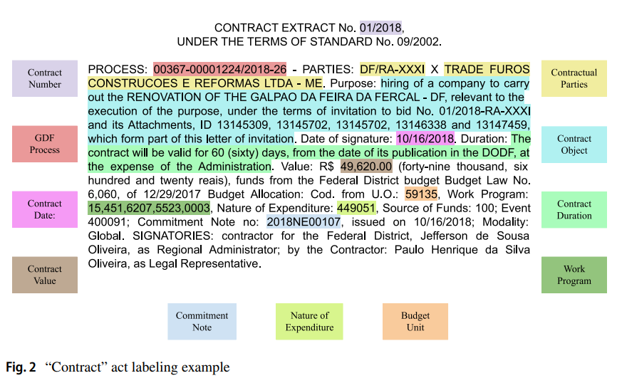
Source: Oliveira *et al*. (2024)

---

# :warning: Problem

> "(...) **Even though this human participation improves model performance, in many projects, the usual process of reading, searching, identifying, circumscribing, and reviewing can be _costly in terms of time, money, and effort_**.'' Oliveira *et al.* (2024)

---

# :bulb: Solution

- Prompting-based language model
- Weak Supervision

---
<!-- _class : centering -->


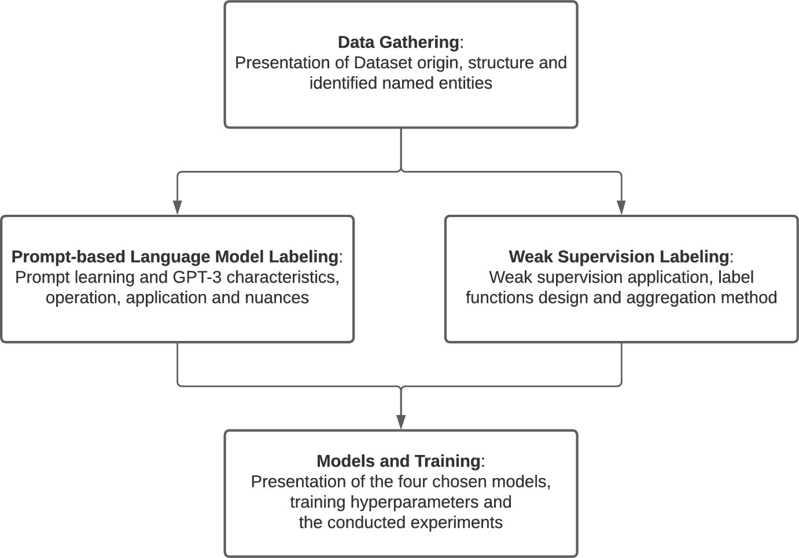
**Figure 1** Workflow methodology. Source: Oliveira *et al*. (2024)

---
<!-- _class : invert -->
# :robot: Prompt-based language models

---
## Prompt-based annotation

- It used the GPT-3 Davinci model
- It had a maximum request of about 2049 tokens
- Three dataset instances were handpicked and randomly given as a prompt-example
- Of course, they selected such example that contains all entities labels
- Davinci applies its prediction to exactly one unlabeled act

---
<!-- _class : centering -->
## Prompt instruction
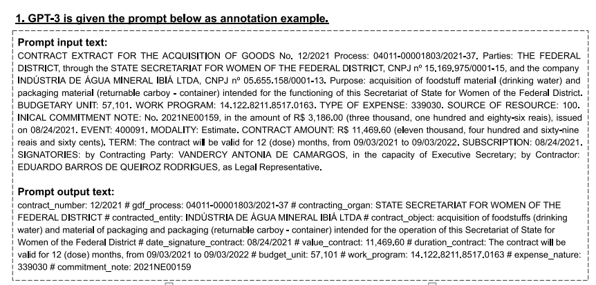
**Figure 3.** GPT-3 prompt-labeling process example. Source: Oliveira *et al*. (2024)

---
<!-- _class : centering -->
## New instance input

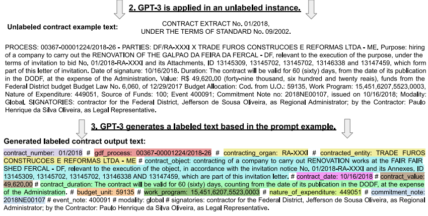
**Figure 3.** GPT-3 prompt-labeling process example. Source: Oliveira *et al*. (2024)

---
<!-- _class : centering -->
## Expected outcome

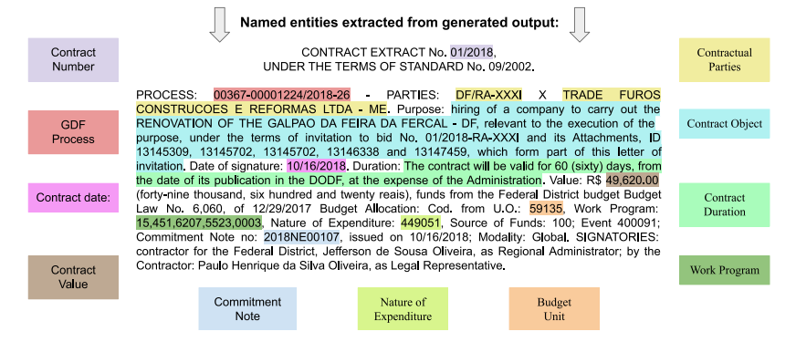
**Figure 3.** GPT-3 prompt-labeling process example. Source: Oliveira *et al*. (2024)

---

# The annotation cost using GPT-3

- To annotated 783 training instances they had
  - 1.565.108 tokens
  - at a final cost of $ 31.30 dollars


---


https://cookbook.openai.com/examples/named_entity_recognition_to_enrich_text

---

## Example

```python
messages = [
          {"role": "system", "content": system_message(labels=labels)},
          {"role": "assistant", "content": assisstant_message()},
          {"role": "user", "content": user_message(text=text)}
      ]

response = openai.chat.completions.create(
    model="gpt-3.5-turbo-0613",
    messages=messages,
    tools=generate_functions(labels),
    tool_choice={"type": "function", "function" : {"name": "enrich_entities"}},
    temperature=0,
    frequency_penalty=0,
    presence_penalty=0,
)
```
---
<!-- _class : invert -->
# :memo: Weak supervision

---

## Weak supervision

One can define heuristic rules based on:
- **Regular expressions**
- **Lookup tables or lists**
- POS patterns or dependency relations
- Presence or neighbouring words within a given context window
- Using machine learning models trained on related tasks

---
<!-- _class : centering -->

## The paper used the [`skweak`](https://github.com/NorskRegnesentral/skweak) library

- Help to implement **Labeling functions** specific heuristics
- It aggregates the resulting labels to obtain a labelled corpus
- It is integrated with [spaCy](https://spacy.io/) library

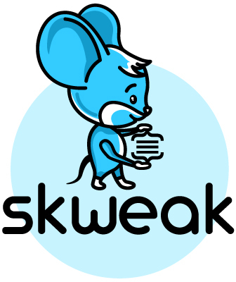

---
<!-- _class : centering -->

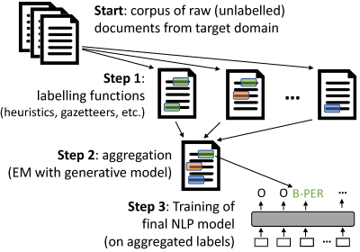
General overview of `skweak`. Source: [Lison, *et. al* (2021)](https://aclanthology.org/2021.acl-demo.40/)

---
# Labelling functions

```python
import spacy, re
from skweak import heuristics, gazetteers, generative, utils

def money_detector(doc):
  ... # do some stuff

heuristics.FunctionAnnotator("money_detector", money_detector)

NAMES = [...] # list of names

trie = gazetteers.Trie(NAMES) # under the hood it uses trie regex
gazetteers.GazetteerAnnotator("presidents", {"PERSON":trie})

```

Source: https://github.com/NorskRegnesentral/skweak/wiki/Step-1:-Labelling-functions

---
<!-- _class : centering -->
## An alternative would be [`snorkel`](https://github.com/snorkel-team/snorkel)


---

```python
from snorkel.labeling import labeling_function
from snorkel.labeling import PandasLFApplier

@labeling_function()
def lf_contains_link(x):
  ...
  # do something

lfs = [lf_contains_link, ... ]

applier = PandasLFApplier(lfs=lfs)
L_train = applier.apply(df=df_train)
```

Source: https://www.snorkel.org/use-cases/01-spam-tutorial

---
## Other resources

- Trie regex
  - [`trieregex`](https://github.com/snorkel-team/snorkel)
  - [`trex`](https://github.com/mesejo/trex)
  - [`flashtext`](https://github.com/vi3k6i5/flashtext) [1](https://calmcode.io/shorts/flashtext.py)
- Spacy rule-based matching [2](https://spacy.io/usage/rule-based-matching)
  - Token matcher
  - Phrase matcher

---
<!-- _class : invert -->
# :test_tube: Experiments

---
##
<!-- _class : centering -->
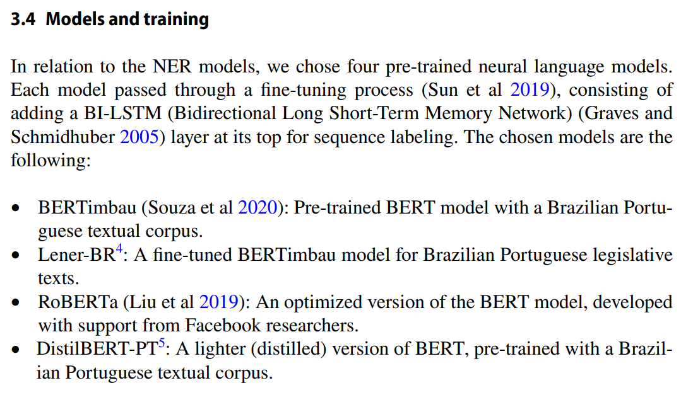
Source: Oliveira *et al*. (2024)

---

<!-- _class : i  -->


```python
import ktrain
from ktrain import text as txt

WV_URL='https://dl.fbaipublicfiles.com/fasttext/vectors-crawl/cc.nl.300.vec.gz'

model = txt.sequence_tagger('bilstm-transformer',
                            preproc,
                            transformer_model='wietsedv/bert-base-dutch-cased',
                            wv_path_or_url=WV_URL)

learner = ktrain.get_learner(model, train_data=trn, val_data=val, batch_size=128)

learner.fit(0.01, 1, cycle_len=5, checkpoint_folder='/tmp/saved_weights')

```
Source https://github.com/amaiya/ktrain/tree/master/examples#seqlab

---
# Models

- Hence, they considered 4 embeddings techniques:
  - [BERTimbau](https://huggingface.co/neuralmind/bert-base-portuguese-cased) (Souza et al 2020)
  - [LeNER-BR](https://huggingface.co/pierreguillou/bert-base-cased-pt-lenerbr) (1)
  - [RoBERTa](https://huggingface.co/FacebookAI/roberta-base)
  - [DistilBERT-PT](https://huggingface.co/adalbertojunior/distilbert-portuguese-cased)

(1) A fine-tuned BERTimbau model, not from the original Luz de Araújo paper

---

## Datasets variations

- They trained each model on:
  - Human labeled
  - GPT-3 labeled
  - Weak-supervision
  - GPT-3 + Human-labeled (gradual combination of 10%, 20% ... 100%)
  - GPT-3 + Weak supervision (complete combination)

> They considered that combination of Weak-supervision and Human-labeled does no make sense, and it is a bad resource management.

---
<!-- _class : invert -->
# :mag_right: Results

---
<!-- _class : centering -->

## \#1 - Isolated annotation datasets

---

<!-- _class : centering -->

| Model              | GPT-3 | Weak supervision | Human labeling |
|--------------------|-------|------------------|----------------|
| NER-LenerBR        | 0.554 | 0.676            | 0.761          |
| NER-BERTimbau      | 0.543 | 0.703            | 0.755          |
| NER-RoBERTa        | 0.542 | 0.674            | 0.707          |
| NER-DistilBERT-PT  | 0.473 | 0.664            | 0.631          |
| Average F1-Scores  | 0.528 | 0.679            | 0.713          |

**Table 3.** F1-Score metric and average F1-Score metric of each model in every dataset

Source: Oliveira *et al*. (2024)

---
<!-- _class : centering -->
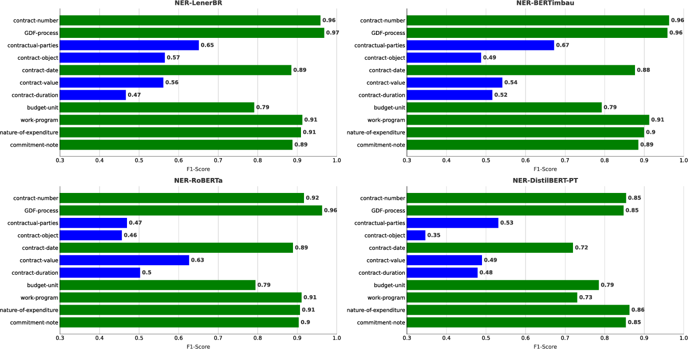
**Figure 5**. F1-Scores of all named entities for each model trained with the human-labeled dataset. In green are the chosen seven best-performing entities.
Source: Oliveira *et al*. (2024)

---

## Seven best entities
1. contract number
2. GDF process
3. contract value
4. budget unit
5. work program
6. nature of expediture
7. commitment note

---
<!-- _class : centering -->
## What do they have in common?


Source: Oliveira *et al*. (2024)

---
<!-- _class : centering -->

| Model              | GPT-3 | Weak supervision | Human labeling |
|--------------------|-------|------------------|----------------|
| NER-LenerBR        | 0.815 | 0.878            | 0.906          |
| NER-BERTimbau      | 0.776 | 0.887            | 0.902          |
| NER-RoBERTa        | 0.798 | 0.881            | 0.899          |
| NER-DistilBERT-PT  | 0.664 | 0.847            | 0.804          |
| Average F1-Scores  | 0.763 | 0.873            | 0.877          |

**Table 4**. F1-Score metric considering only the seven best performing named entities.
Source: Oliveira *et al*. (2024)

---
<!-- _class : centering -->

## \#2 - Combining percentages of Human and GPT-3 labeling

---
<!-- _class : centering -->
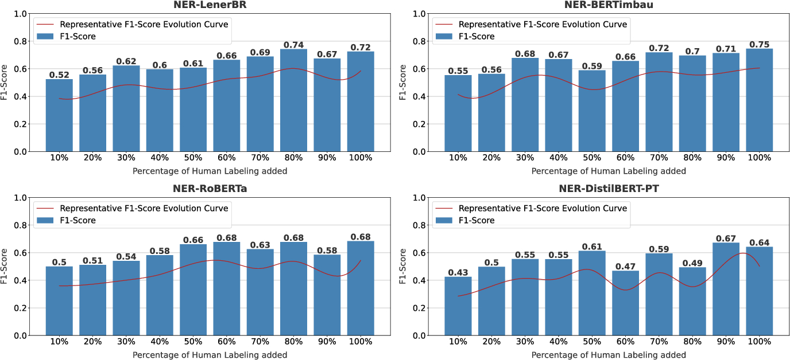
**Figure 6**. F1-Score over the GPT-3 and Human Labeling combining iterations and all eleven entities. Source: Oliveira *et al*. (2024)

---
<!-- _class : centering -->
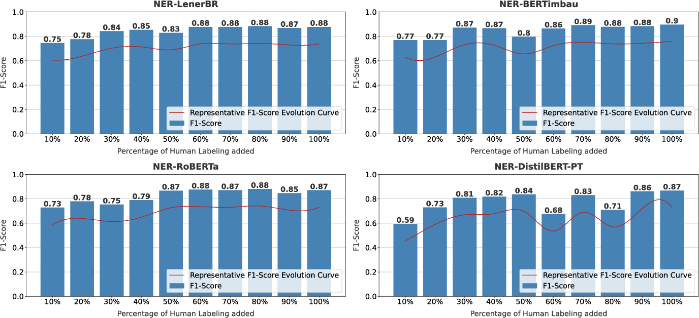
**Figure 7**. F1-Score over the GPT-3 and Human Labeling combining iterations considering only the seven best-performing entities. Source: Oliveira *et al*. (2024)

---
<!-- _class : centering -->

## \#3 - Combination of GPT-3 and Weak-supervision labeling

---
<!-- _class : centering -->
|                    | GPT-3 and weak supervision | GPT-3 and weak supervision |
|--------------------|----------------------------|----------------------------|
| **Model**          | All eleven entities        | Seven best entities        |
| NER-LenerBR        | 0.709                      | 0.888                      |
| NER-BERTimbau      | 0.686                      | 0.884                      |
| NER-RoBERTa        | 0.558                      | 0.773                      |
| NER-DistilBERT-PT  | 0.632                      | 0.831                      |
| Average F1-Scores  | 0.646                      | 0.844                      |

**Table 5**. F1 scores values resulting the combination of GPT-3 and Weak supervision datasets. Source: Oliveira *et al*. (2024)

---
<!-- _class : centering -->

## \#4 - The preservation score analysis

---
## Preservation score

$$ P_{score} = \frac{F1_{tested\_model}}{F1_{human\_label}} $$

Where $F1_{tested\_model}$ correspond to:
- GPT-3
- Weak-supervision
- GPT-3 + Weak-supervision
- GPT-3 + 30% Human

---
<!-- _class : centering -->

| Model              | GPT-3 | Weak-Sup | GPT Weak-Sup | GPT 30% Human |
|--------------------|-------|----------|--------------|---------------|
| NER-LenerBR        | 0.728 | 0.888    | 0.931        | 0.818         |
| NER-BERTimbau      | 0.719 | 0.931    | 0.908        | 0.897         |
| NER-RoBERTa        | 0.766 | 0.953    | 0.789        | 0.765         |
| NER-DistilBERT-PT  | 0.749 | 1.052    | 1.001        | 0.877         |
| Average            | 0.740 | 0.956    | 0.907        | 0.839         |

**Table 6-A**. Preservation score comparison for all eleven entities. Source: Oliveira *et al*. (2024)

---
<!-- _class : centering -->

| Model              | GPT-3 | Weak-Sup | GPT Weak-Sup | GPT 30% Human |
|--------------------|-------|----------|--------------|---------------|
| NER-LenerBR        | 0.899 | 0.969    | 0.980        | 0.930         |
| NER-BERTimbau      | 0.860 | 0.983    | 0.980        | 0.966         |
| NER-RoBERTa        | 0.887 | 0.980    | 0.859        | 0.838         |
| NER-DistilBERT-PT  | 0.825 | 1.053    | 1.033        | 1.006         |
| Average            | 0.867 | 0.996    | 0.963        | 0.935         |

**Table 6-B**. Preservation score for the seven best entities. Source: Oliveira *et al*. (2024)

---
<!-- _class : centering -->
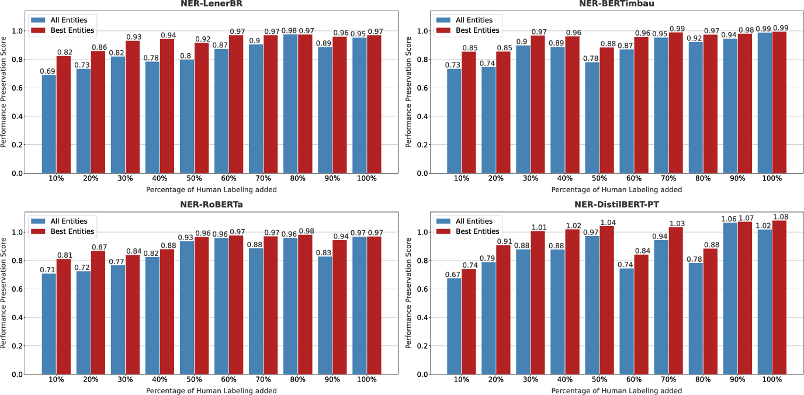
**Figure 8**. Preservation score for each iteration on the combination of GPT-3 and Human annotation. Source: Oliveira *et al*. (2024)

---
<!-- _class : centering -->
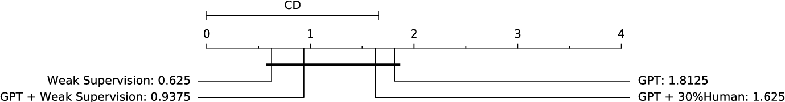
**Figure 9**. Friedman's test with Nemenyi's post test graphical analysis. Source: Oliveira *et al*. (2024)

---

# :dart: Conclusions

- These strategies can still be a valid approach, even with their lower performance trade-off
- Human labeling is the best strategy considering accuracy and performance
- The statistical test did not show significant differences between the alternative approaches
- Limitations are:
  - There is no precise way to estimate each approach's cost
  - The size of the dataset
  - Did not considered the mistakes among annotators.

---

# My observations

- How the GPT-3 and the weak supervision annotation agrees with the human labeled dataset?
- Is worth to compute standard metrics considering the weak supervision and the prompt-based as a black box model?
- Is it possible to explorer other [prompt engineering](https://www.promptingguide.ai) techniques?


---

# :scroll: References

- Carpintero, D. **Named Entity Recognition to Enrich Text**. 2023. OpenIA Cookbook. <https://cookbook.openai.com/examples/named_entity_recognition_to_enrich_text>
- Knowledge Extraction from Documents of Legal content. <https://unb-knedle.github.io/>
- Lison, P; Barnes, J; Hubin, A. 2021. **skweak: Weak Supervision Made Easy for NLP** Proceedings of the 59th Annual Meeting of the Association for Computational Linguistics and the 11th International Joint Conference on Natural Language Processing: System Demonstrations
- Ratner, Alex; Varma, P; Hancock B; Ré, C; and others. 2019. **Weak Supervision: A New Programming Paradigm for Machine Learning**. <https://ai.stanford.edu/blog/weak-supervision/>

---

# :scroll: References

Models card:
- BERTimbau <https://huggingface.co/neuralmind/bert-base-portuguese-cased> (Souza et al 2020)
- LeNER-BR <https://huggingface.co/pierreguillou/bert-base-cased-pt-lenerbr>
- RoBERTa <https://huggingface.co/FacebookAI/roberta-base>
- DistilBERT-PT <https://huggingface.co/adalbertojunior/distilbert-portuguese-cased>